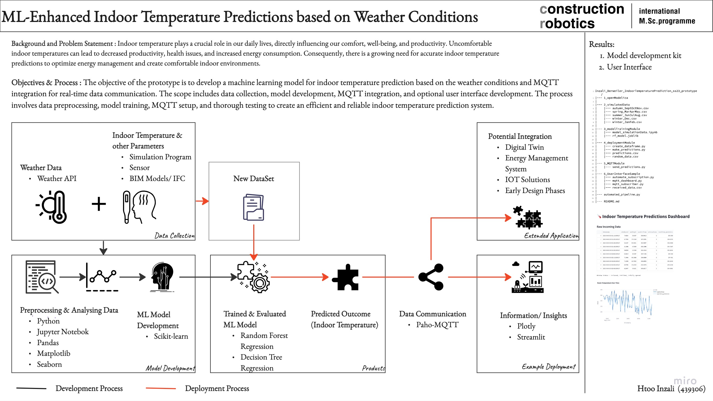

# Indoor Temperature Prediction with Machine Learning 

This GitHub repository contains the code and documentation for an indoor temperature prediction prototype developed using machine learning and MQTT communication. The prototype aims to provide accurate indoor temperature forecasts based on historical weather data, simulated building-specific information, and advanced deep learning techniques.

## Prerequisites:

1. Python (>= 3.6): Ensure that Python is installed on your system before proceeding with the installation.
2. Scikit-learn libraries to utilize the LSTM-based regressions indoor temperature prediction model.
3. Paho MQTT Library: Install the Paho MQTT client library for efficient MQTT communication.
4. OpenModelica (optional): If you want to train the model using simulation data, install OpenModelica to generate weather scenarios for training.

## Workflow:

## User Guide:

### To Develop the Prediction Model

#### Data Collection: 1_openModelica or similar simulation environment or sensor data and save into 2_simulatedData 

1. Gather historical indoor temperature data from buildings equipped with temperature sensors.
2. Obtain weather data (temperature, humidity, solar radiation) from reliable sources or simulate weather scenarios using OpenModelica.

### Data Preprocessing: 3_modelTrainingModule

1. Prepare the historical indoor temperature and weather data for training the model.
2. Handle missing values and normalize the features to a consistent range.

#### Model Training: 3_modelTrainingModule

1. Run the model training module to train the LSTM-based indoor temperature prediction model.
2. Tune the hyperparameters to optimize the model's performance.

#### Integration with MQTT publish: 5_MQTTModule 

1. Set up an MQTT broker to act as an intermediary for communication.
2. Implement the MQTT client module to publish indoor temperature predictions and receive real-time updates.

### To Develop Simple User Interfafce (Optional): 6_UserInterfaceSample

#### User Interface:

1. Design and develop a user-friendly interface to interact with the prediction model.
2. Provide options for users to input weather parameters and building characteristics.

#### Real-Time Indoor Temperature Prediction:

1. Deploy the prototype to start predicting indoor temperatures in real-time.
2. Access the predicted temperatures through subscribing devices or your user interface.

### Prototype Using Sensor Data
7_sensorDataModel

This is a seperate prototype sample using sensor data as data collection method. Completely independent from other components of the prototype packages above. 

## Acknowledgments:

Special thanks to the open-source community and developers of all the necessary tools and libraries which made this prototype possible. 
In this prototype, the machine learning methods, skills and understandings learned from IBM open courseware "Machine Learning with Python: A Practical Introduction" were applied. 